# US Police Shootings
Analysis of the Washington Post's database on deaths by police in the United States and the US census data on poverty rate, high school graduation rate, median household income, and racial demographics to better understand social trends and what is going on with the fatal use of force by the police in the United States.
# Table of contents
• **Project Objective**  
The primary objective of this research is to gain a comprehensive understanding of social trends and the factors contributing to fatal police use of force in the United States.  

•	**Methods Used**  
The analysis encompasses the following methods:   
o	Data Cleaning  
o	Preliminary Data Exploration  
o	Data Visualization  

•	**Technologies Utilized**  
o	Python  
o	Pandas  
o	NumPy  
o	Seaborn  
o	Matplotlib  
o	Plotly  

•	**Project Description**  
This study is based on two distinct datasets:  
1. **Washington Post Dataset**: It comprises 2535 records collected between 2015 and 2017, focusing on deaths by police in the United States.  
2. **US Census Dataset**: This dataset consists of four separate files with 29329 entries each, detailing:  
- Poverty rates  
- High school graduation rates  
- Median household income  
- Racial demographics  
The datasets were meticulously cleaned to ensure data accuracy and consistency.

•	**Project Results**  *
1.	**Poverty Rate in each US State**  
The analysis reveals that Alabama has the highest poverty rate, while New Hampshire and North Montana exhibit the lowest rates.  

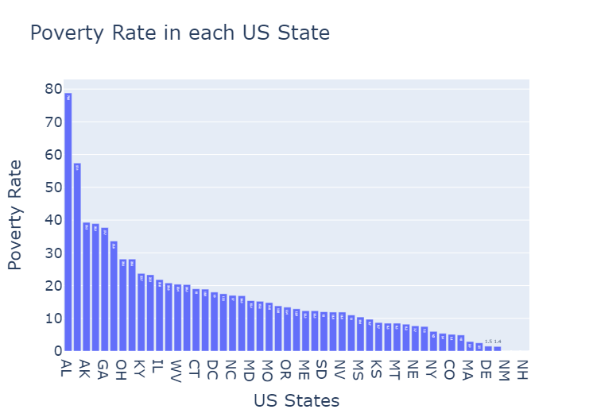

2.	**High School Graduation Rate by US State**  
Examining high school completion rates indicates that Massachusetts, Hawaii, and Connecticut have the highest numbers of high school graduates, whereas Texas, Mississippi, and Georgia have the lowest numbers.  

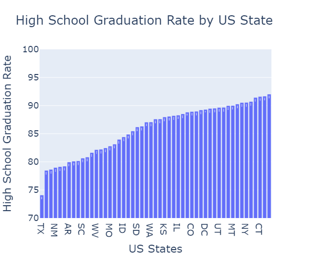
 
3.	**Relationship between Poverty Rates and High School Graduation Rates**  
A negative correlation was observed between poverty rates and high school graduation rates, implying that higher poverty rates are associated with lower graduation rates and vice versa. Most data points cluster in the top-left quadrant, indicating that the majority of states have low poverty rates and high graduation rates.  

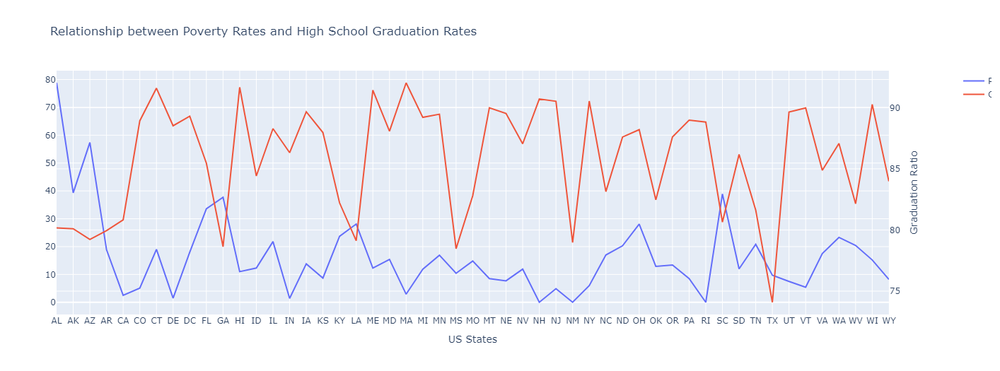
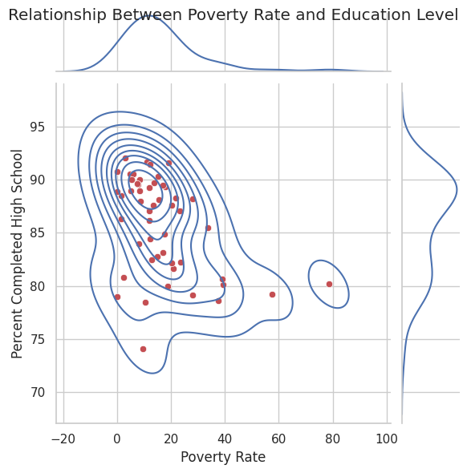
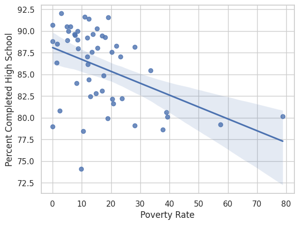

4.	**Racial makeup of each US State**  
The racial composition, including White, Black, Hispanic, Asian, and Native American populations, varies across states. White populations predominate in all states, followed by Hispanic populations, while Asian populations are relatively smaller.  

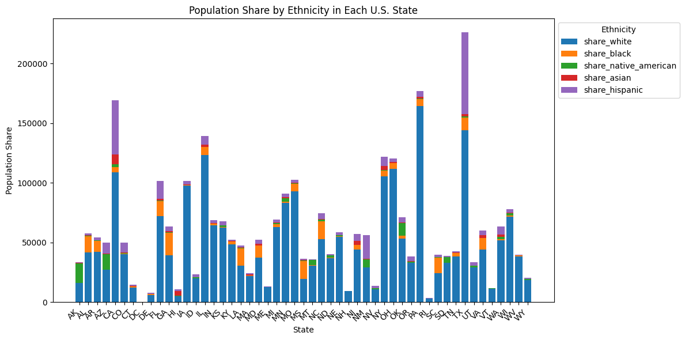
 
5.	**People killed by Race**  
The analysis reveals that Black individuals constitute approximately half of the population of victims,  while Native American individuals are the least targeted victims.  
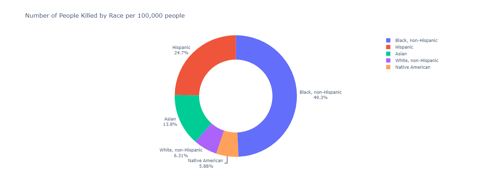

6.	**Total Number of Deaths of Men and Women**  
The data illustrated that the majority of fatalities are men.  

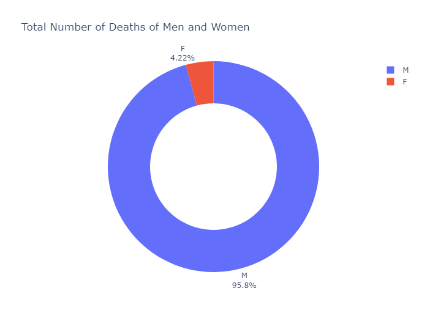
 
7.	**Gender and Manner of Death**  
Analyzing the relationship between gender and manner of death demonstrates that victims are predominantly shot or shot and tasered. Additionally, more men are killed by these means compared to women.  

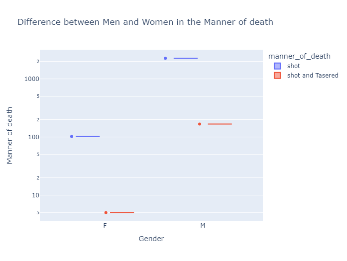
 
8.	**Type of Weapon Carried by the Deceased**  
The data indicates that nearly all victims were armed, with only 7% being unarmed. The majority of armed victims were carrying firearms, followed by knives, vehicles, and toy weapons.  

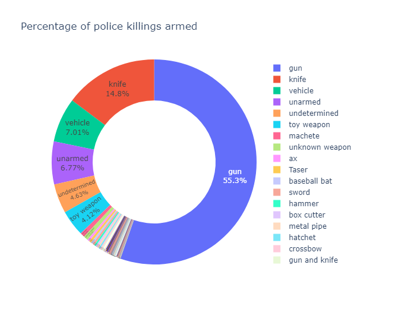
 
9.	**Percentage of People killed by Age**  
The distribution of age among victims shows that the majority fall within the 26 to 45 age range, with a median age of 35. This distribution is consistent across all racial groups.  

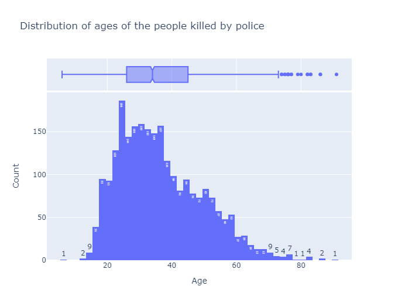

10.	**Mental Illness and Police Killings**  
Approximately three-quarters of the victims did not have a diagnosed mental illness, while one-quarter did.

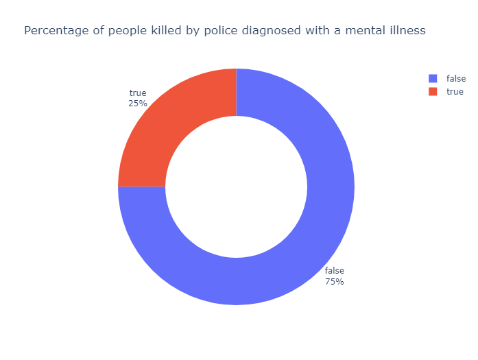

12.	**Top 10 cities with the most Police Killings**  
The data reveals Los Angeles, Phoenix, and Houston as the top three cities with the highest number of police killings, while Austin and St. Louis have the lowest numbers.  

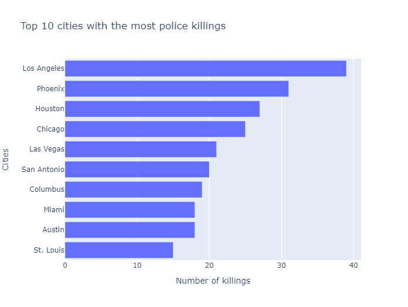
 
13.	**Rate of Death by Race**  
The analysis indicates that the highest rates of death by race in the top 10 cities with the most killings are among Black and Hispanic individuals, with Asian and Native American individuals experiencing the lowest rates.  

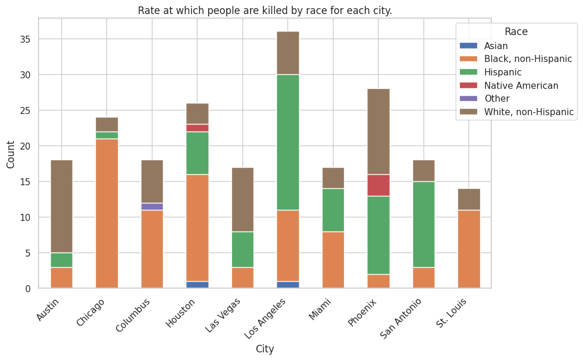

14.	**Map of Police Killings by US States**  
The map provides insights into the states with the highest incidence of police killings, with California, Texas, and Florida appearing as the most dangerous states.  

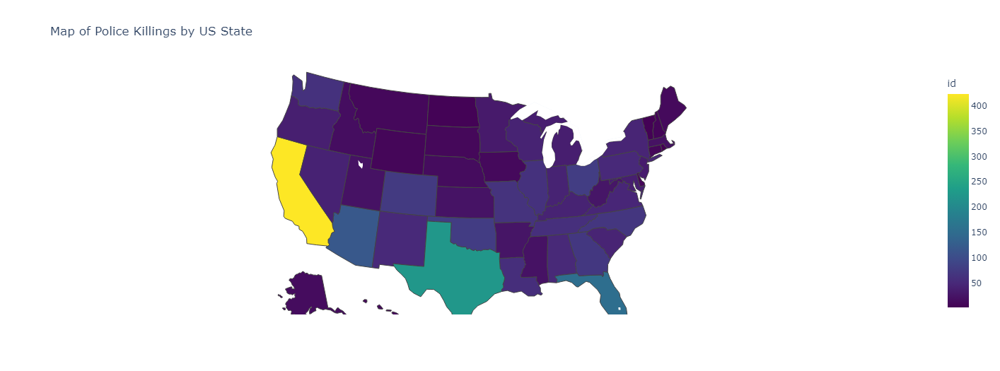
 
15.	**Number of Police Killings over time**  
A declining trend in the number of police killings is observed, with a nearly 50% reduction in the number of killings between 2015 and 2017.  

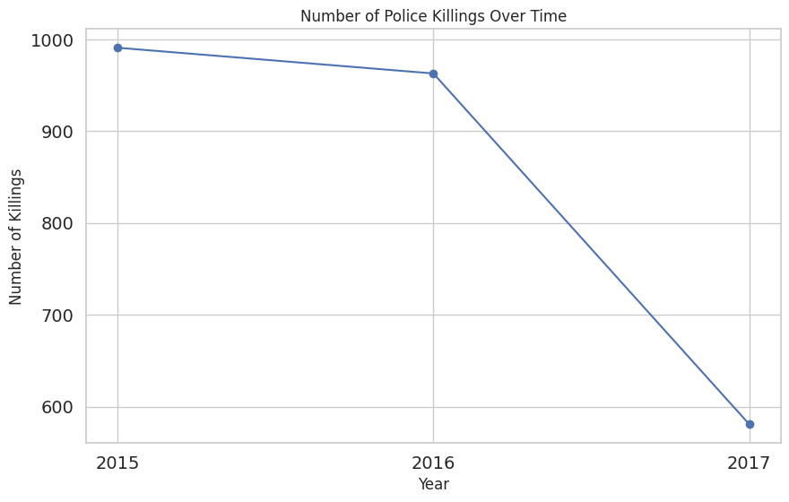
